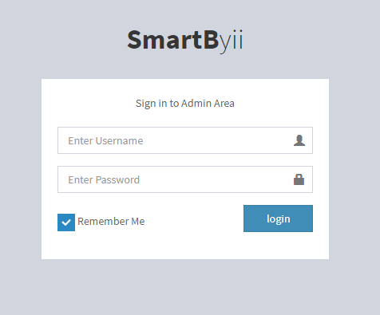

User Documentation
==================
Hello, this is some text to fill in this, [here](#user-login), is a link to the second place.
[Link to Git](#markdown-header-1-git-to-work-working-with-git)


Backend
-------
- [Login User]
- Create new User
- Admin Users
- Roles for Users
- Update Profile
- Change Password


Frontend 
--------
- sign up User
- Login User
- Update Profile
- Change Password
- Password Recover


# Login User {#login}




```
<section class="content-header">
    <h1>
        My yii2 kit 
        <small> for start any web application </small>
    </h1>
    <ol class="breadcrumb">
        <li><a href="#"><i class="fa fa-dashboard"></i> Home</a></li>
        <li><a href="#">Layout</a></li>
        <li class="active">Top Navigation</li>
    </ol>
</section>
```

[//]: #
[Login User]: #login


